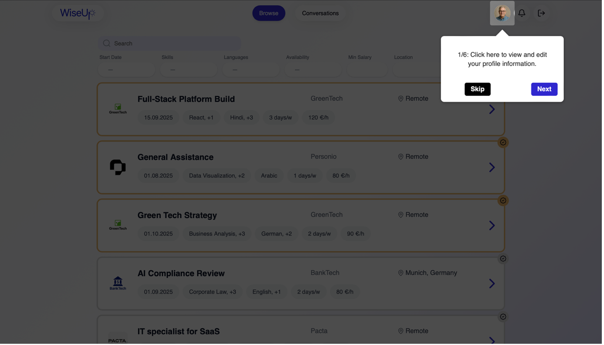
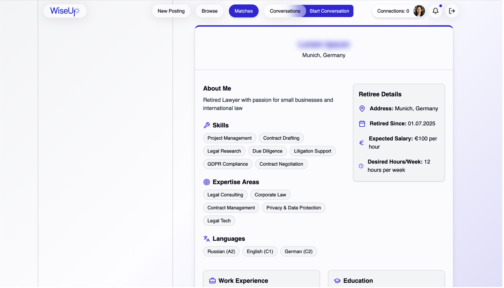

Table of Contents
=================
- [Introduction](#wiseup--matching-platform-frontend--backend)
- [1. The Problem We Solve](#1-problem-we-solve)
- [2. Customer Journey (Product Walkthrough)](#2-customer-journey-product-walkthrough)
- [3. Tech Stack](#3-tech-stack)
- [4. Getting Started](#4-getting-started)
- [5. License](#5-license)

---

# WiseUp — Matching Platform (Frontend & Backend)

> **WiseUp** connects startups with experienced retirees to provide affordable, flexible domain-specific expertise — while giving retirees purpose, recognition and extra income.

## About this Project

WiseUp was conceived, designed, and implemented as part of the  
[Software Engineering for Business Applications (SEBA) Master’s course](https://wwwmatthes.in.tum.de/pages/1mqqqoqe7gapz/Software-Engineering-for-Business-Applications-SEBA-Master) at TUM.  

As part of this course, we:
- **Ideated** the concept and value proposition.  
- **Developed** a business plan and matching model.  
- **Created** customer journeys, personas, and UI mockups.  
- **Implemented** the platform as a working web application (frontend & backend).  

wiseup-matching contains the **frontend and Backend implementation** of that project.

## Contributors

This project was created by a team of four Master’s students:  

- [Jakob](https://github.com/jmoehler)  
- [Sebastian](https://github.com/sebastianmoelder)  
- [Michael](https://github.com/mschmidm)  
- [Renée](https://github.com/reneemschmitt1) 

## TL;DR

- **What**: The full WiseUp matchmaking platform (Frontend + Backend).  
- **Why**: Startups lack budget for senior expertise; retirees want meaningful, flexible work. WiseUp matches both sides efficiently.  
- **How**: A smooth, passwordless UX with guided sign-up, search, automatic matches, and in-app chat.  

---

## 1. The Problem We Solve

Early-stage startups need targeted expertise but cannot afford full-time hires or big-firm consulting. Meanwhile, many healthy, motivated retirees want to keep contributing on their own terms.  

WiseUp bridges that gap with a curated, two-sided marketplace and matching flow that turns **experience into momentum** for startups and **meaning into work** for retirees.

---

## 2. Customer Journey (Product Walkthrough)

Use these anchors to place your A3 screenshots in context.

1. **Landing Page**  
   

2. **Retiree Sign-Up (Magic Link)**  
     

3. **Onboarding Questionnaire**  
      

4. **Retiree Home**  
   
   

5. **Startup Profile & Job Listings**  
   

6. **Create New Job Posting**  
   

7. **Browse Retirees**  
   

8. **Automatic Matches**  
   
   

9. **Subscription Upgrade Prompt**  
   

10. **Chat & Hiring**  
     

11. **Profile Status Change**  
   

> **Note on Exposures**: “Exposures” position listings more prominently based on the startup’s Stripe plan (Gold at top, then Silver). Insert **[A3 — Figures 28–29]** where you describe plans.

---

## 3. Tech Stack

**Frontend**
- [React](https://react.dev/) + [TypeScript](https://www.typescriptlang.org/) (with [Vite](https://vitejs.dev/) as build tooling)  
- [shadcn/ui](https://ui.shadcn.com/) components  
- API client generated from Backend **OpenAPI** spec  
- Tooling: ESLint, Prettier, Docker (for local/dev)  

**Backend (consumed by this app)**  
- [Node.js](https://nodejs.org/) with TypeScript HTTP API  
- [OpenAPI](https://www.openapis.org/) specification as API contract
- [MongoDB](https://www.mongodb.com/) for persistence  
- [Docker Compose](https://docs.docker.com/compose/) for containerized services  
- Authentication: passwordless email-based sign-in (“magic link”)  
- Features: profile onboarding, job listings, automated matching, messaging, subscription & exposure logic  
- External services: [Brevo](https://www.brevo.com/) for transactional emails, [Stripe](https://stripe.com/) for payments  

---

## 4. Getting Started

Check the individual [Frontend README](https://github.com/wiseup-matching/frontend-public) and [Backend README](https://github.com/wiseup-matching/backend-public) for setup instructions.  

You need to configure `.env` files with the correct credentials.  

In order to run the entire application you’ll need:  
- [Brevo](https://www.brevo.com/) (emails)  
- [MongoDB](https://www.mongodb.com/) (database)  
- [Stripe](https://stripe.com/) (payments & subscriptions)  

---

## 5. License

This project is licensed under the MIT License.
